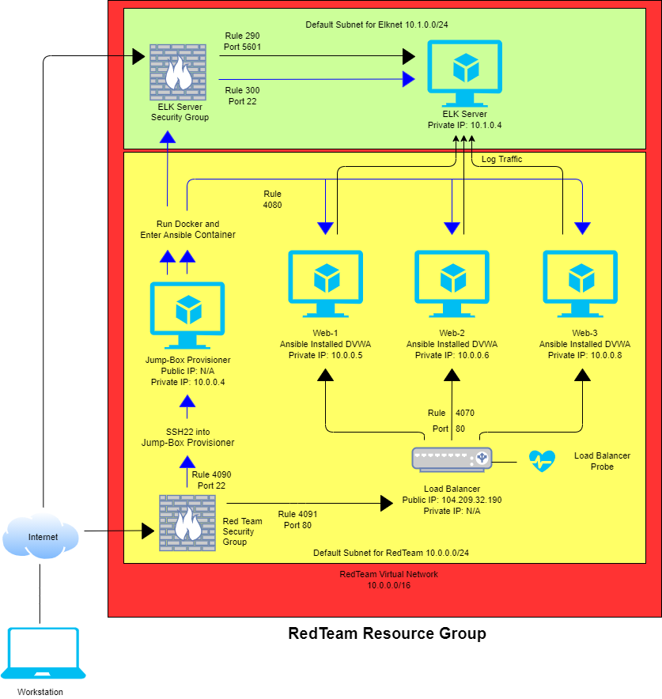

## Generating Your Azure Environment

The files in this repository were used to configure the network depicted below.

These files have been tested and used to generate a live ELK deployment on Azure. They can be used to either recreate the entire deployment pictured above. Alternatively, select portions of the Ansible file may be used to install only certain pieces of it; the ELK playbook, Filebeat or Metricbeat.

[ELK playbook](Ansible/elk.yml)  
[Filebeat-playbook](Ansible/filebeat-playbook.yml)  
[Metricbeat-playbook](Ansible/metricbeat-playbook.yml)

This document contains the following details:  
- Description of the Topology  
- Setup of the Different Components within an Azure Environment  
  - Resource Group  
  - Network Security Group  
  - Virtual Machine (JumpBox Provisioner)  
  - Virtual Machines (Web Server Machines)  
  - Virtual Machine (ELK Machine)  
  - Load Balancer  
  - Access Policies created within the Network Security Groups  
  - Containers setup through Docker

### Description of the Topology

The main purpose of this network is to expose a load-balanced and monitored instance of DVWA, the D*mn Vulnerable Web Application.

Load balancing ensures that the application will be highly accessible, in addition to restricting inbound traffic to the network.
- A load balancer can add an additional layer of security by utilizing a health probe that will regularly check the machines for issues and stop sending traffic to it if an issue is detected. It can reduce the effects of DDoS attacks by distributing traffic.
- A Jump Box is used to create a single indentifiable port of entry into the other machines via SSH on port 22. This is set up through the Network Security Group.

Integrating an ELK server allows users to easily monitor the vulnerable VMs for changes to the filesystem and system metrics.
- Filebeat works by looking for changes to log data and sending that information to be viewed through Kibana.
- Metricbeat works by collecting the metrics of the operating system and services running and then sends that information to be viewed through Kibana.

The configuration details of each machine may be found below.
