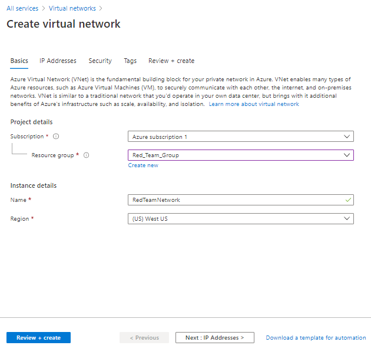
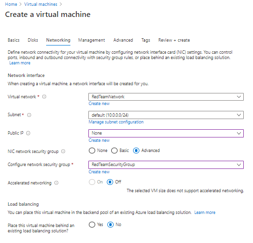

## Generating Your Azure Environment

This is the step by step method of setting up the components for a live ELK deployment on Azure.

This document contains the following details:  
- Description of the Topology  
- Setup of the Different Components within an Azure Environment  
  - Resource Group  
  - Network Security Group  
  - Virtual Machine (JumpBox Provisioner)  
  - Virtual Machines (Web Machines)  
  - Virtual Machine (ELK Machine)  
  - Load Balancer  
  - Access Policies created within the Network Security Groups  
  - Containers setup through Docker

### Description of the Topology

The main purpose of this network is to expose a load-balanced and monitored instance of DVWA, the D*mn Vulnerable Web Application.

A single point of entry to configure the network is created through the JumpBox Provisioner. From there is access to the load balanced web machines, as many as desired. There is also access to the ELK Server virtual machine. Each subnet will have it's own assoscated Security Group which all lies within one Resource Group. 

The configuration details of each machine may be found below.

### Resource Group

A resource group is a grouping of all resources used for a project, from networks, firewalls, virtual computers and more.  
  - Select Resource Group and Click Add  
  - Select your region and give the group a name  
  - Review and Create  
  
  
### Virtual Network

A virtual Network is a collection of Virtual Machines that communicate with each other. Two will be created for this projected, one for the first subnet containing the JumpBox, Web Machines, Load Balancer and one for the ELK subnet. These two networks will have to be connected to allow traffic to go back and forth the Networks by generating a Peer Connection.  

#### Web based Virtual Network  
  - Select Virtual Network and Click Create Virtual Network  
  - Select the Resource Group that was created  
  - Enter a name that will define the Network  
  - Make sure that it is in the same region  
  - Leave all settings as is in the other tabs  
  - Review and Create  
      
  
#### ELK based Virtual Network  
  - Select Virtual Network and Click Create Virtual Network  
  - Select the Resource Group that was created  
  - Enter a name that will define the ELK Network  
  - Choose a different region  
  - Under IP Addresses, notice that a new subnet has been created  
  - Leave all settings as is in the other tabs  
  - Review and Create  
      
  
#### Peer Connection  
  - Go to the ELK Virtual Network that was just created and select Peerings  
  - Click Add  
  - Enter a name that will define the connection from ELK to Red  
  - Under Virtual Network, select the original Web network  
  - Enter a name that will define the connection from Red to ELK  
  - Leave all other settings as defaults  
    
 
 ### Network Security Group  
 
The Network Security Group is the basic firewall for the Azure platform. This is where we will control traffic going in and out by creating rules and permissions for the various devices and ports.

  - Select Network Security Group and Click Create Network Security Group  
  - Select the Resource Group that was created  
  - Enter a name that will define the Security Group  
  - Make sure that it is in the same region as the Web Network  
  - Review and create  
  - We will be creating all the inbound rules after the rest of the componets have been added.  
    
  
### Virtual Machines

A Virtual Machine is just like a physical computer but has the flexibility to have the power and storage that is desired for each individual machine. For this project we will generate our point of entry machine, called our JumpBox Provisioner. We will also create several load balanced Web Machines that will be connecting to the Internet and then a final ELK Server machine that will be running the ELK Stack monitoring. All these machines will be connected by SSH keys going through port 22.  

#### Generating SSH Key
  - Open terminal on desired machine and run ssh-keygen, this will generate a SSH key into the default directory of ~/.ssh/id_rsa  
  - Do not enter a password, press enter twice to leave a blank password  
  - To access the key run cat ~/.ssh/id_rsa.pub  

#### JumpBox Provisioner  

  - Select Virtual Machines, click add, click virtual machine  
  - Select the Resource Group that was just created  
  - Enter a name that will define the Virtual Machine  
  - Make sure that it is in the region chosen for Web Virtual Network  
  - Select the size of the virtual machine that is desired (for this project B1s was chosen)  
  - Select SSH public key  
  - Enter in a username that will be used to SSH into the JumpBox from the host machine
  - For SSH public key source, select Use existing public key  
  - For SSH public key, paste in the key that was generated on the host machine  
  - Under the Networking tab make sure Public IP has something in the field  
  - Under NIC network security group, select Advanced, then for Configure network security group select the security group that we created.  
    
    
    
  
#### Web Virtual Machines  

  - Select Virtual Machines, click add, click virtual machine  
  - Select the Resource Group that was created  
  - Enter a name that will define the Virtual Machine  
  - For Availability Options, select Availability Set  
  - For Availability Set, Create New (Any additional web machines will just select the availability set created)  
  	
  - Make sure that it is in the region chosen for Web Virtual Network  
  - Select the size of the virtual machine that is desired (for these machines B1ms was chosen)  
  - For SSH you can use the key from the host machine until we develop the containers, after that we will use the key generated in the container.  
  - Select SSH public key  
  - Enter in a username that will be used to SSH into the virtual machines from the JumpBox  
  - For SSH public key source, select Use existing public key  
  - Copy the SSH key generated within the Ansible container of the JumpBox  
  - Under the Networking tab, for Public IP select None (these machines will eventually get the Load Balancer IP address)  
  - Under NIC network security group, select Advanced, then for Configure network security group select the security group that we created.  
  
  
  

#### ELK Virtual Machines  

  - Select Virtual Machines, click add, click virtual machine  
  - Select the Resource Group that was created  
  - Enter a name that will define the Virtual Machine  
  - For Availability Options, select No infrastructure redundancy required  
  - Make sure that it is in the region chosen for ELK Virtual Network  
  - Select the size of the virtual machine that is desired (This one must be 4GiB memory or higher, preferably 8 GiB, for this we used D2s_v3)  
  - For SSH you can use the key from the host machine until we develop the containers, after that we will use the key generated in the container.  
  - Select SSH public key  
  - Enter in a username that will be used to SSH into the virtual machines from the JumpBox  
  - For SSH public key source, select Use existing public key  
  - Copy the SSH key generated within the Ansible container of the JumpBox  
  - Under the Networking tab, for Public IP, allow it to create one  
  - Under NIC network security group, select Basic (by selecting basic a ELK Security Group will be created with an SSH rule already included)  
  
  

### Load Balancer  

A load balancer is designed to receive all traffic coming into the website and then distribute it across our multiple Web servers. It will define our external IP address for the website. It is crucial for maintaining the availability of our website and can protect against Denial of Service attacks. If the website site receives more traffic than can be handled, more Web servers can be added to the system.

  - Select Load Balancers and Click Create Load Balancer  
  - Select the Resource Group that was created  
  - Enter a name that will define the Load Balancer  
  - Make sure that it is in the region chosen for Web Virtual Network  
  - For Public IP address, select Create New  
  - For Public IP address name, enter in the name given to the Load Balancer  
  - For IP address management, select Static (this will keep the public IP address the same even if the system goes down)
  - Leave all else the same and click create.  
    

#### Health Probe  

A health probe is created to check the machines behind the load balancer before traffic is sent to them. If a machine has an issue, then the load balancer stops sending traffic to that machine. 

  - Click Go To Resource  
  - Click Health Probe and add one  
  - Name it something that will define the Health Probe  
  - Leave all others the same  
  
  
#### Backend Pool  

The Backend Pool is created to define what machines will run through the Load Balancer. 

  - Click Go To Resource  
  - Click Backend Pool and add one  
  - Name it something that will define the Backend Pool  
  - For Virtual Network, select the Web Machine Network  
  - For Associate to, select Virtual Machines  
  - Click Add and then select all Web Machines to be load balanced  
  
  
#### Load Balancing Rule  

A Load Balancing Rule is created to define what ports the traffic will go through to reach the Backend Pool of machines. 

  - Click Go To Resource  
  - Click Load Balancing Rule and add one  
  - Name it something that will define the Load Balancing Rule  
  - For Backend Pool, select the one created  
  - For Health Probe, select the one created  
  - For Session Persistence, select Client IP and Protocol  
  - Leave all others the same and click OK
  

### Security Rules  

Traffic coming into the system and throughout the system are all controlled by the rules we create. Here we will create the rules that will allow a connection into the JumpBox machine and then all traffic from there. 

#### SSH Port-22  

This rule is created to allow SSH access into the JumpBox Provisioner from our host machine.  
  - For Source, select IP Addresses  
  - For Source IP, enter in the host machine IP address  
  - For Destination Port Ranges, enter in 22  
  - For Priority, enter in a value below 4096 (the highest rule number Azure will allow), the lower the number the higher the priority  
  - For Name, enter a name defining the rule  
  - For Description, enter what the rule is allowing  
    
  
Now that this rule is created you should be able to SSH into the JumpBox via the host machine. To test this, from the terminal run the command: ssh (username)@(JumpBox public IP address). 
  
#### SSH From JumpBox into Web Machines  

This rule is created to allow SSH access into the Web Machines from our JumpBox. It will be entered into the Web Machines security group.  
  - For Source, select IP Addresses  
  - For Source IP, enter in the JumpBox public IP address  
  - For Destination, select VirtualNetwork  
  - For Destination Port Ranges, enter in 22  
  - For Priority, enter in a value higher than or having a lower priority than SSH Port-22  
  - For Name, enter a name defining the rule  
  - For Description, enter what the rule is allowing  
    
  
#### Port 80 Traffic  

This rule is created to allow web traffic access into the Web Machines through port 80.  
  - For Source, select IP Addresses  
  - For Source IP, enter * to allow web traffic in from any IP address  
  - For Destination, select VirtualNetwork  
  - For Destination Port Ranges, enter in 80  
  - For Priority, enter in a value higher than or having a lower priority than the previous 2 rules  
  - For Name, enter a name defining the rule  
  - For Description, enter what the rule is allowing  
    
  
#### Host Machine to Kibana   

This rule is created to allow the host machine access into the ELK Machine through port 5601 for Kibana.  
  - For Source, select IP Addresses  
  - For Source IP, enter host machine IP address  
  - For Destination, select VirtualNetwork  
  - For Destination Port Ranges, enter in 80  
  - For Priority, enter in a value higher than the SSH rule   
  - For Name, enter a name defining the rule  
  - For Description, enter what the rule is allowing  
   
  
### Containers  

Containers are esentially lightweight Virtual Machines. This gives greater flexibility in the number of machines desired at a lower cost. They can be deployed quickly and are able to be automatically configured. This allows the machines to all run identically and remove the element of human error in setting up each machine. For this project we will be using Docker for the containers and configure them with Ansible.

  - SSH into the JumpBoxProvisioner  
  - Run sudo apt-get update  
  - Run sudo apt install docker.io  
  - Run sudo systemctl status docker 
    
  - If is shows it's not active then run sudo systemctl start docker 
    
  - Run sudo docker pull cyberxsecurity/ansible  
  - Run sudo docker run -ti cyberxsecurity/ansible:latest bash  
  - This will have started the container and should show root@(something):~#  
  - exit  
  - Run sudo docker container list -a  
    
  - Under the names you will see the name of the container
  - Run sudo docker start (container name)  
  - Run sudo docker ps  
  - Run sudo docker attach (container name)  
  
You are in the Ansible container. From here you can generate the SSH key for this machine. Return to each of the Web Machines and ELK Machine, click on Reset Password and paste in the new key that was created. You can now test the connections to the various machines by SSH into each with: ssh (username)@(Web/ELK Machine private IP address)

