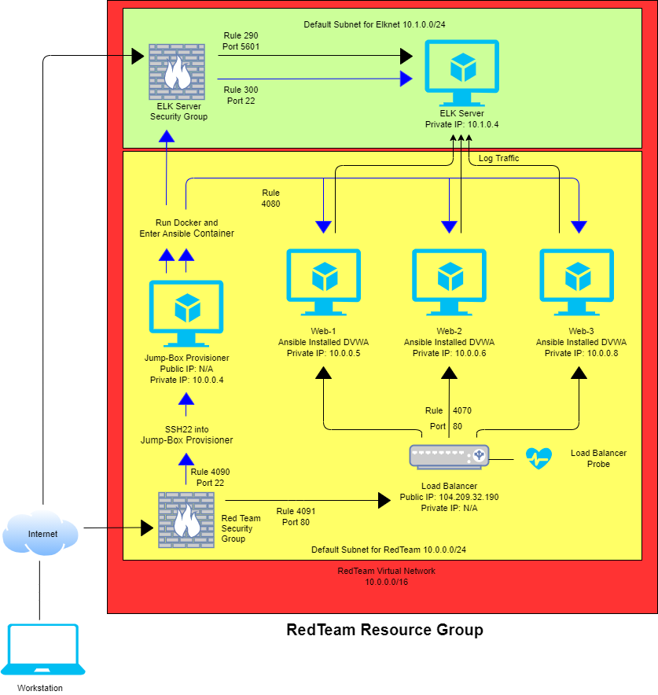
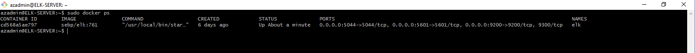
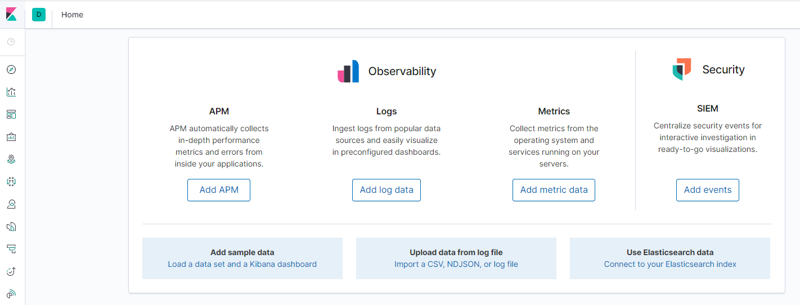
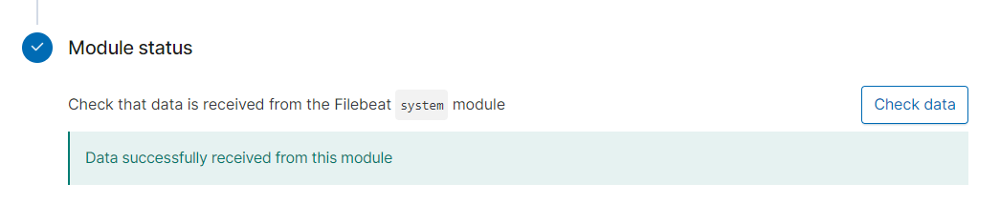
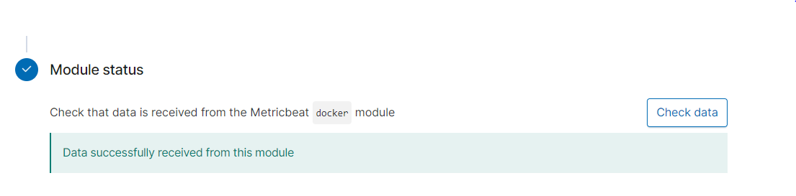

## Automated ELK Stack Deployment

The files in this repository were used to configure the network depicted below.  

These files have been tested and used to generate a live ELK deployment on Azure. They can be used to either recreate the entire deployment pictured above. Alternatively, select portions of the Ansible file may be used to install only certain pieces of it; the ELK playbook, Filebeat or Metricbeat.

[ELK playbook](Ansible/elk.yml)  
[Filebeat-playbook](Ansible/filebeat-playbook.yml)  
[Metricbeat-playbook](Ansible/metricbeat-playbook.yml)  

This document contains the following details:  
- Description of the Topology  
- Access Policies  
- ELK Configuration  
  - Beats in Use  
  - Machines Being Monitored  
- How to Use the Ansible Build  

### Description of the Topology

The main purpose of this network is to expose a load-balanced and monitored instance of DVWA, the D*mn Vulnerable Web Application.  

Load balancing ensures that the application will be highly accessible, in addition to restricting inbound traffic to the network.  
- A load balancer can add an additional layer of security by utilizing a health probe that will regularly check the machines for issues and stop sending traffic to it if an issue is detected. It can reduce the effects of DDoS attacks by distributing traffic.  
- A Jump Box is used to create a single indentifiable port of entry into the other machines via SSH on port 22. This is set up through the Network Security Group.  

Integrating an ELK server allows users to easily monitor the vulnerable VMs for changes to the filesystem and system metrics.  
- Filebeat works by looking for changes to log data and sending that information to be viewed through Kibana.  
- Metricbeat works by collecting the metrics of the operating system and services running and then sends that information to be viewed through Kibana.  

The configuration details of each machine may be found below.  

| Name          | Function            | IP Address                       | Operating System |
|---------------|---------------------|----------------------------------|------------------|
| JumpBox       | Gateway             | 10.0.0.4                         | Linux            |
| Web 1/DVWA    | Web Server          | 10.0.0.5                         | Linux            |
| Web 2/DVWA    | Web Server          | 10.0.0.6                         | Linux            |
| Web 3/DVWA    | Web Server          | 10.0.0.8                         | Linux            |
| ELK Server    | Monitoring          | 10.1.0.4                         | Linux            |
| Load Balancer | Balance Web Traffic | Public IP shared with Web 1,2,3  | Linux            |

### Access Policies

The machines on the internal network are not exposed to the public Internet.  

Only the JumpBox Provisioner machine can accept connections from the Internet via SSH on port 22. Access to this machine is only allowed from the IP addresses that have been granted permission through the SSH-Port22 rule, located in the Network Security Group.    

Machines within the network can only be accessed by the JumpBox Provisioner, the JumpBox Private IP Address is 10.0.0.4.  

A summary of the access policies in place can be found in the table below.  

| Name       | Publicly Accessible | Allowed IP Addresses         |
|------------|---------------------|------------------------------|
| JumpBox    | Yes                 | Your host machine IP Address |
| Web 1/DVWA | No                  | 10.0.0.4                     |
| Web 2/DVWA | No                  | 10.0.0.4                     |
| Web 3/DVWA | No                  | 10.0.0.4                     |
| Elk Server | No                  | 10.0.0.4                     |

### Elk Configuration

Ansible was used to automate configuration of the ELK machine. No configuration was performed manually, which is advantageous because it greatly reduces the chance of human error over the course of potentially configuring thousands of machines.

The playbook implements the following tasks:

The header which will specify the elkservers along with the remote user with access.

    - name: Configure Elk VM with Docker
      hosts: elkservers
      remote_user: azadmin
      become: true
      tasks:

Installation of docker.io, python3-pip and docker:

    # Use apt module
    - name: Install docker.io
      apt:
        update_cache: yes
        force_apt_get: yes
        name: docker.io
        state: present

      # Use apt module
    - name: Install python3-pip
      apt:
        force_apt_get: yes
        name: python3-pip
        state: present

      # Use pip module (It will default to pip3)
    - name: Install Docker module
      pip:
        name: docker
        state: present

Installation to increase virtual memory:

      # Use command module
    - name: Increase virtual memory
      command: sysctl -w vm.max_map_count=262144

      # Use sysctl module
    - name: Use more memory
      sysctl:
        name: vm.max_map_count
        value: '262144'
        state: present
        reload: yes

Then to select the docker container and establish the ports that will be used by the various ELK stack components:

      # Use docker_container module
    - name: download and launch a docker elk container
      docker_container:
        name: elk
        image: sebp/elk:761
        state: started
        restart_policy: always
        # Please list the ports that ELK runs on
        published_ports:
          - 5601:5601
          - 9200:9200
          - 5044:5044

You can view your new elk container by running sudo docker container list -a (elk should be a listed container)  
If the elk container hasn't started run: sudo docker start elk  

The following screenshot displays the result of running `docker ps` after successfully configuring the ELK instance.  

- navigate to http://[your.VM.IP]:5601/app/kibana. If successful then the webpage should load.  

### Target Machines & Beats  
This ELK server is configured to monitor the following machines:  
- Web 1 DVWA Container (10.0.0.5), Web 2 DVWA Container (10.0.0.6), Web 3 DVWA Container (10.0.0.8)  

We have installed the following Beats on these machines:  
- Web 1/DVWA (Filebeat, Metricbeat)  
- Web 2/DVWA (Filebeat, Metricbeat)  
- Web 3/DVWA (Filebeat, Metricbeat)  

These Beats allow us to collect the following information from each machine:  
- _TODO: In 1-2 sentences, explain what kind of data each beat collects, and provide 1 example of what you expect to see. E.g., `Winlogbeat` collects Windows logs, which we use to track user logon events, etc._

### Using the Playbook  
In order to use the playbook, you will need to have an Ansible control node already configured. Assuming you have such a control node provisioned: 

SSH into the control node and follow the steps below:  
### For Filebeat:  
- Copy the [filebeat-config.yml](Ansible/filebeat-config.yml) and [filebeat-playbook.yml](Ansible/filebeat-playbook.yml) files to your /etc/anisble folder.  
- Update the filebeat-config.yml file to include:  
  line #1105 hosts: ["your ELK machine IP:9200"]  
  line #1806 host: "your ELK machine IP:5601"  
- Within your [hosts](Linux/hosts) file located in your /etc/ansible folder, make certain that hosts: [webservers] contains all IP addresses of the machines that you wish to be observed. An example as currently configured:  

      [webservers]
      ## alpha.example.org
      ## beta.example.org
      ## 192.168.1.100
      ## 192.168.1.110
      10.0.0.5 ansible_python_interpreter=/usr/bin/python3
      10.0.0.6 ansible_python_interpreter=/usr/bin/python3
      10.0.0.8 ansible_python_interpreter=/usr/bin/python3

also: [elkservers] has it's IP address included:  

    [elkservers]
    10.1.0.4 ansible_python_interpreter=/usr/bin/python3

- Run the playbook, ansible-playbook filebeat-playbook.yml  
- Navigate to http://[your.VM.IP]:5601/app/kibana  
  - Select "Add log data"  
  - Select "System logs"  
  - Select "Deb" and scroll down to number 5 "Module status"  
  - Select "Check Data" and you should see success and that you are receiving data.  
	

### For Metricbeat:
- Copy the [metricbeat-config.yml](Ansible/metricbeat-config.yml) and [metricbeat-playbook.yml](metricbeat-playbook.yml) files to your /etc/anisble folder.
- Update the metricbeat-config.yml file to include:
  line #62 host: "your ELK machine IP:5601"
  line #95 hosts: ["your ELK machine IP:9200"]
- Within your [hosts](Linux/hosts) file located in your /etc/ansible folder, make certain that hosts: [webservers] contains all IP addresses of the machines that you wish to be observed. An example as currently configured:  

      [webservers]  
      ## alpha.example.org  
      ## beta.example.org  
      ## 192.168.1.100  
      ## 192.168.1.110  
      10.0.0.5 ansible_python_interpreter=/usr/bin/python3  
      10.0.0.6 ansible_python_interpreter=/usr/bin/python3  
      10.0.0.8 ansible_python_interpreter=/usr/bin/python3  

also: [elkservers] has it's IP address included:  

     [elkservers]  
     10.1.0.4 ansible_python_interpreter=/usr/bin/python3  
     
- Run the playbook, ansible-playbook metricbeat-playbook.yml  
- Navigate to http://[your.VM.IP]:5601/app/kibana  
  - Select "Add metric data"  
  - Select "Docker metrics"  
  - Select "Deb" and scroll down to number 5 "Module status"  
  - Select "Check Data" and you should see success and that you are receiving data.  
      

