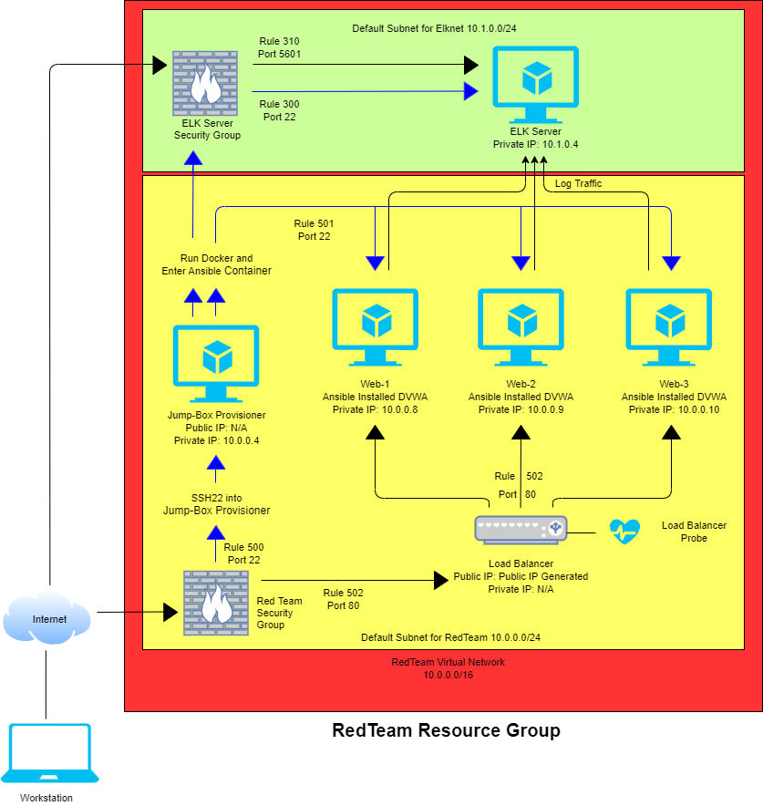

## Configuring an Azure Enviroment with an Automated ELK Stack Deployment

The files in this repository were used to configure the network depicted below.  

All files have been tested and used to generate Ansible containers for web server machines and a live ELK deployment on Azure. They can be used to either recreate the entire deployment pictured above. Alternatively, select portions of the Ansible file may be used to install only certain pieces of it, such as Filebeat.  

This document is broken down into two main fields:  
- Setup and configuration of the Azure environment  
- Setup and configuration of the ELK stack monitoring system  

### Description of the Topology

#### The Azure Infrastructure  

The Azure environment will have all the elements depicted in the image above. The steps to create them and then connect them through Security Rules will all be included. There will also be included the deployment of Ansible containers to configure the Web machines. The number of web machines desired can change based on your needs, three was used in the example provided.  
- Resource Group  
- Virtual Network  
- Network Security Group with rules to allow traffic  
- Virtual Machines (JumbBox, Web Machines and ELK)  
- Load Balancer with Health Probe and Backend Pool  
- Ansible Containerization to configure the Web Server Machines  

#### ELK Stack Deployment  

The ELK Stack is created to monitor the Web Machines by going through various logs and presenting it all through a useable interface, Kibana. The steps to set up and configure the ELK container are included along with the setup and configuration of two tools, Filebeat and Metricbeat. Filebeat collects data about the files on the system and monitors any changes to them. Metricbeat collects data on machine metrics such as CPU usage and Uptime.  
- ELK stack container setup  
- Filebeat configuration and setup  
- Metricbeat configuration and setup  
